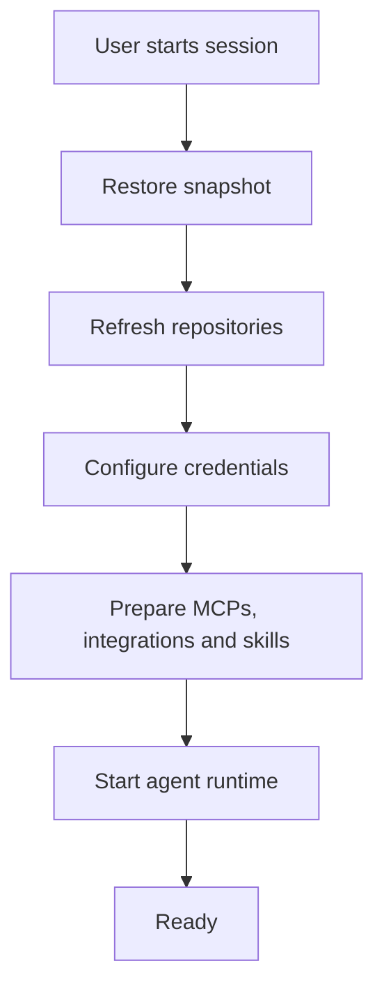
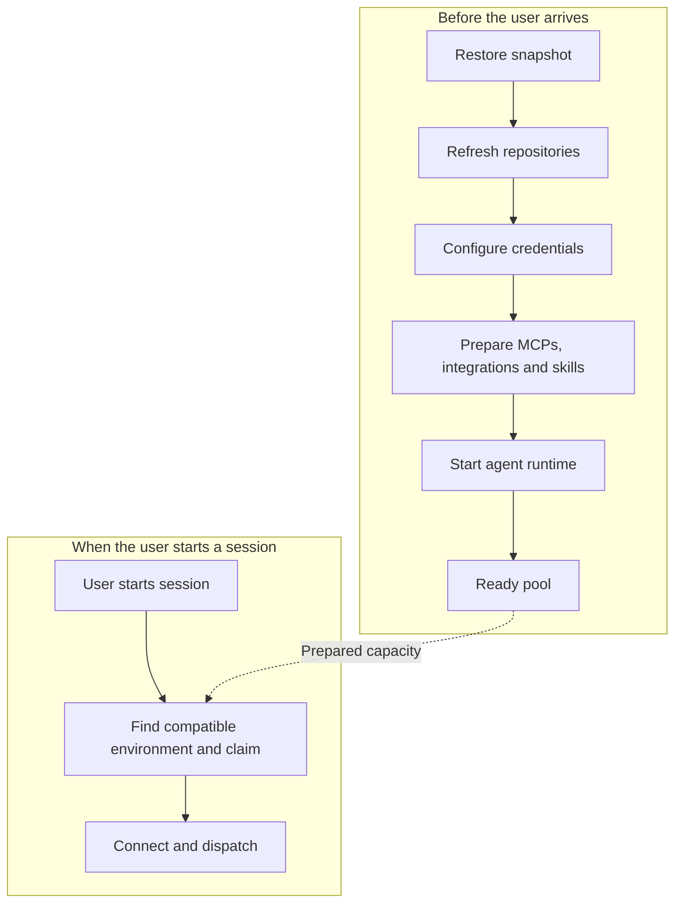

When you start a new session in Tembo, we want your environment to feel like it was already there waiting for you.

Not just a machine with an operating system. Your repositories, your tools, your integrations, and an agent ready to work.

The conventional answer to making that happen quickly is snapshots. Boot a machine, prepare it, save its state, and restore it when you need another one. We've invested heavily in making QEMU/NixOS snapshot restores fast. Restoring a prepared VM can be dramatically faster than booting and configuring a machine from scratch.

Snapshots are especially useful when resuming an existing session. You already have an environment; we want to recover it rather than rebuild it.

But while optimizing startup for new sessions, we kept running into a different problem:

**It doesn't really matter how fast you can restore a VM if restoring the VM isn't the thing the user is waiting for.**

## A running VM isn't a ready agent

A snapshot gives us a starting point. It doesn't necessarily give us an environment that is ready for the session arriving right now.

Repositories may have changed since the snapshot was built. Git authentication needs to work. Integrations and credentials need to be configured. MCP servers need to reflect the selected configuration. Skills and project-specific setup need to be applied. Then the agent runtime itself needs to start.

None of that work has a fixed cost. One project might have a single repository and very little setup. Another might have several repositories, multiple integrations, and a collection of MCP servers.

Making snapshot restoration faster only shortens one part of that sequence.

**Snapshot restore time and environment readiness time are two different measurements.**

Even a sub-second restore followed by several seconds of initialization would still be a several-second startup from your perspective. The machine is running, but you're waiting.

That distinction changed where we focused our effort.

### Before: initialization on demand

### After: initialization before demand

*These diagrams group the work conceptually, rather than showing exact execution order. Initialization time varies with the environment. The important change is that the work moved, not that every box became faster.*

## Don't make startup faster. Do it earlier.

Most of the expensive initialization is predictable before you send a message.

If we know the project and its intended runtime configuration, we already know much of what the environment needs: which repositories to prepare, which snapshot to use, how large the sandbox should be, and which integrations, MCP servers, skills, and setup to configure.

Your next instruction is unknown. The environment in which the agent will handle it often isn't.

So instead of waiting for a request and racing to initialize everything, we do that work ahead of time.

Prepare the environment first. Hand it to the session when it's needed.

The architecture has three layers:

- **[Projects](/features/projects) describe the environment we want.** They connect repository selection, setup, sandbox sizes, and snapshot configuration.
- **Snapshots make that environment cheaper to reproduce.** We don't need to rebuild the same starting point every time.
- **Warm pools instantiate and finish preparing environments before someone asks for them.**

There is an important distinction between a machine that is merely running and the prepared capacity we want for this path.

**A prepared Tembo warm-pool VM isn't merely a VM that happens to be running. It's an environment waiting to be adopted.**

That includes an idle agent runtime. We're not only moving operating-system startup earlier; we're moving the initialization around the agent earlier, too.

## What happens when you start a session

In the ordinary startup path, work is queued, a VM is acquired or restored, setup runs, and the agent eventually becomes available.

A successful prepared warm-pool hit takes a different path. QEMU is already running. Repositories and integrations have been prepared. The agent runtime is waiting.

The remaining work looks like this:

1. Find a compatible prepared VM.
2. Atomically claim it.
3. Associate it with the new session.
4. Adopt the prepared agent runtime.
5. Dispatch your instruction.

The ownership transfer happens atomically in the database, so two concurrent sessions cannot successfully claim the same machine.

On this path, we avoid the normal queued setup process. We don't enqueue a fresh boot and then ask you to wait while the environment becomes useful. We connect your session to capacity we have already prepared.

There is still foreground work: compatibility checks, session association, runtime adoption, and dispatch. But restoring and initializing the environment are no longer part of it.

This is also why the measurement boundary matters. Claiming an already-prepared VM is not the same as booting a fresh machine, and neither is the same as receiving the agent's first token. A fast handoff doesn't erase request processing, network delivery, or model latency.

<Note>
  Draft visual placeholder: insert a real prepared warm-pool claim recording with
  the measurement's start and end boundaries visible. After verifying a result
  below 50 ms, caption it: “A prepared warm-pool VM being claimed in under 50 ms.
  Environment preparation happened before the session started.” This is not an
  end-to-end agent-startup measurement.
</Note>

## Precomputation creates a new problem: staleness

Preparing everything in advance sounds straightforward until something changes.

A repository receives new commits. An integration changes. Someone updates the project or MCP configuration. A new snapshot becomes active. Credentials approach expiration. The requested runtime no longer matches the one we prepared.

A machine can be healthy and running while still being the wrong machine to hand to a new session.

So a warm pool cannot mean “create a VM and leave it running forever.” It has to mean “maintain prepared capacity that is still eligible for the environment we need.”

We record information about how each environment was prepared. A runtime profile describes the configuration it can safely serve. A separate repository generation tracks the repository state against which preparation was performed.

Before reuse, we compare that preparation with the requested environment. Is the snapshot appropriate? Does the runtime configuration match? Is the repository generation still eligible? Are the preparation credentials fresh enough? Is the host still available to serve it?

When relevant state changes, incompatible capacity is rotated rather than blindly handed to another session.

Freshness also has a cost. Rebuilding an environment for every push in a busy repository would create constant churn. We group repository changes before refreshing prepared capacity, rather than rebuilding for every commit. That creates a freshness window: a prepared VM doesn't instantly reflect every external change.

Once initialization moves earlier, deciding whether its result is still reusable becomes part of startup correctness.

## Keeping the pool full

The next problem is availability. A prepared VM stops being spare capacity as soon as a session claims it.

For a warm-enabled project, the simplest mental model is **keep one ready** for each configured size, subject to available capacity. The desired count is maintained across eligible hosts, rather than independently multiplying it on every host.

When a session claims that VM, two things happen independently:

- The session starts using the prepared environment.
- Tembo requests a replacement for the pool.

The replacement is restored, initialized, and made ready for a future session. You don't wait for it.

Event-driven replenishment handles normal consumption. Periodic reconciliation handles everything that doesn't fit the happy path: missed events, unhealthy machines, configuration changes, stale snapshots, and hosts entering or leaving service.

The reconciler compares what should exist with what actually exists, then fills deficits or retires capacity that no longer belongs.

If demand stays within the pool's reserve and replenishment capacity, successive sessions keep finding environments that are already prepared. But average demand isn't the whole story. A burst can consume every ready slot before a replacement finishes, even if the long-term request rate is low.

When that happens, the slower startup paths still exist. Warm pooling improves the prepared-hit path; it doesn't make capacity limits disappear.

<Note>
  Draft animation placeholder: show Project A with one Ready VM, then that VM
  being claimed and moving to a session. Show the vacant pool slot becoming
  Preparing, then Ready again. Keep the active session separate from the
  replacement and loop the sequence. Optionally show an incompatible Ready VM
  being retired and replaced.
</Note>

## The complicated system behind a toggle

You shouldn't need to understand this machinery to benefit from it.

In Tembo, warm pooling is enabled per project. You choose the project and enable the behavior; Tembo handles snapshot selection, preparation, compatibility checks, claiming, and replenishment.

The same project definition can serve your team without everyone maintaining a separate setup. Warm pooling adds prepared capacity to that shared starting point. For repository selection, setup scripts, and environment options, see the [Projects documentation](/features/projects).

That simple control hides a real resource tradeoff.

Prepared machines are running machines. They reserve memory, disk, and compute capacity before a session needs them. Increasing the reserve can improve hit rates, but it also increases idle resource consumption. Keeping too little reserve means more requests encounter an empty pool.

The work hasn't disappeared, and it hasn't become free. We have changed when it happens and introduced a scheduling problem: how much prepared capacity should exist, where should it live, and when should it be replaced?

That is the cost of making the environment feel like it was waiting for you. We actually have to keep an appropriate environment waiting.

## Snapshots still matter

The lesson isn't that snapshots are unimportant. Snapshots and warm pools solve different parts of the problem.

A snapshot gives us a reusable starting point. A warm VM removes on-demand boot. A prepared runtime removes much of the initialization that would otherwise follow. Reconciliation keeps that preparation eligible for reuse. An atomic claim transfers ownership to a session.

Each layer makes the next one useful.

Snapshots remain important for rebuilding pool capacity, recovering existing sessions, and starting environments when no compatible prepared VM is available. Portable disk snapshots also provide a recovery option when saved runtime state cannot be reused.

Warm pooling changes the new-session path by moving restoration earlier:

**If the VM is already running, snapshot restore latency disappears from the user's critical path entirely.**

We still care how quickly snapshots restore. Faster restoration means we can refill capacity sooner and recover from depletion more quickly. It just isn't work that every successful prepared-pool request has to wait for.

## The fastest initialization is initialization you don't wait for

We started with a seemingly straightforward performance question: how quickly can we restore a VM?

That work mattered. But looking at the whole path to a useful agent environment changed the question:

**How much of this work needs to happen after the user arrives at all?**

Repository preparation often doesn't. Neither do MCP setup, integrations, skills, or the initial agent-runtime startup.

Projects tell us what to prepare. Snapshots give us a reusable foundation. Warm pools do the work before demand arrives. Reconciliation keeps the prepared capacity valid, and replenishment makes it available for the next session.

Instead of treating every new session as an initialization job, we can treat a compatible prepared hit as an ownership handoff.

Sometimes the fastest way to make startup faster isn't to optimize startup. It's to make sure startup already happened.
