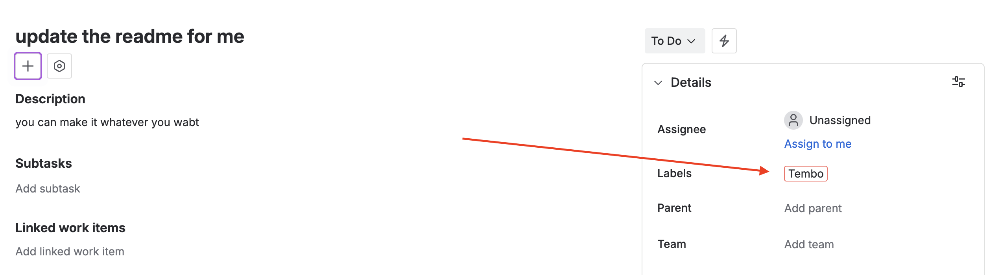

Assign Jira tickets to Tembo and turn them into PRs.

# Features

- Add the "Tembo" label to issues to trigger analysis
- Click provided links to view coding sessions and create PRs

# Installation

<Steps>
  <Step title="Create Tembo Account">
    Create a dedicated Jira account for Tembo using either an email alias
    (`youremail+tembo@company.com`) or a dedicated email (`tembo@company.com`).
    Invite this account to your Jira workspace and complete the sign-up process
    using the name "Tembo".
  </Step>
  <Step title="Connect">
    Navigate to the [Integrations page](https://app.tembo.io/integrations) in
    Tembo and click the `Install` button next to Jira. Make sure you're logged
    into the Tembo Jira account (not your personal account) when completing this
    step.
  </Step>
  <Step title="Add Labels">
    Create a "Tembo" label in your Jira project if it doesn't exist:

    1. Navigate to your Jira project settings by clicking the gear icon in the project sidebar
    2. Select "Labels" from the project settings menu
    3. Click "Create label" and enter "Tembo" as the label name
    4. Save the label

    Once created, add this label to any issue you want Tembo to analyze and work on by editing the issue and selecting the "Tembo" label.

    
  </Step>
  <Step title="Start Sessions">
    After labeling tickets, Tembo will comment with analysis and provide a link
    to view the session.
  </Step>
</Steps>

# Supported Triggers

Tembo maps Jira activity to workflow triggers (use a `jira.*` naming convention in your `triggerName`). The Integrations page in the app shows the live set enabled for your org. Supported events:

- `issue.created`
- `issue.updated`
- `issue.labeled`
- `issue.assigned`
- `transition.changed`
- `comment.created`

See Workflow Automations for how to create triggers from these events.
