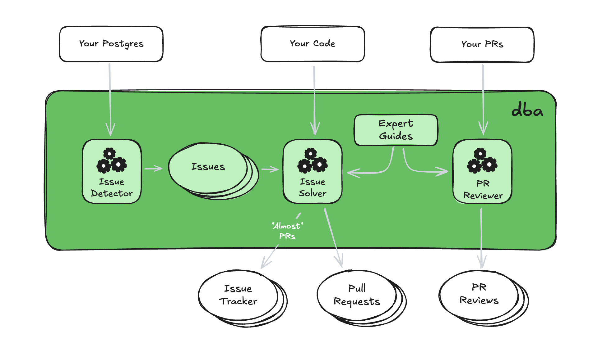

**dba** is an AI Agent that identifies issues in your production Postgres, and
attempts to solve these issues directly in your codebase autonomously.

It sends pull requests for solutions that it's confident in, and works as your co-pilot to solve other issues.

<Info>
  **dba** is in invite-only private alpha testing. For early access, email
  hi@dba.ai.
</Info>

## Architecture

dba is the first autonomous AI agent that closes the gap between database monitoring and software engineering.

<Frame>
  
</Frame>

By continuously detecting and solving issues, dba can help you quickly burn down your existing issues, detect regressions, and solve emergent issues before they become a problem.

## Get Started

If you're new to dba, you can get started using the guides below:

<CardGroup cols={2}>
  <Card title="AWS" icon="aws" href="integrations/aws">
    Get started with **dba** in minutes by connecting your AWS
  </Card>
  <Card title="Github" icon="github" href="integrations/github">
    Connect your Github repositories that interact with your Postgres instances
  </Card>
</CardGroup>
